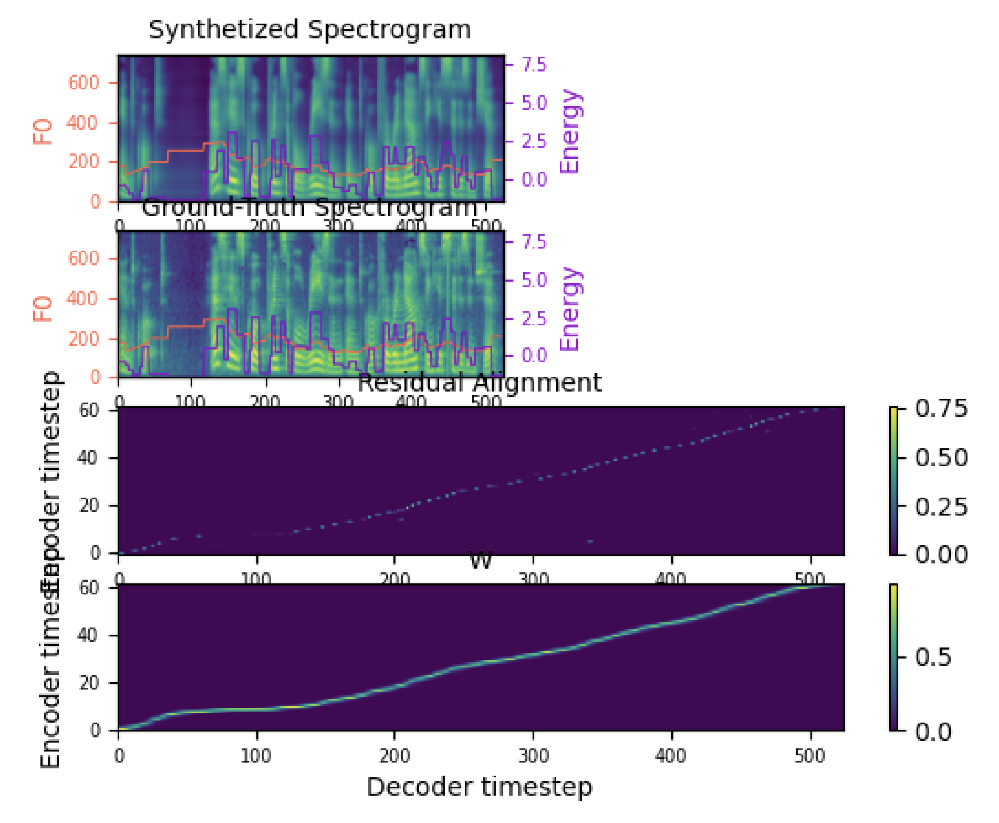

# Soft DTW Loss Function for PyTorch in CUDA

This is a Pytorch Implementation of [Soft-DTW: a Differentiable Loss Function for Time-Series](https://arxiv.org/abs/1703.01541) which is `batch supported computation`, `CUDA-friendly`, and `feasible to use as a final loss`. I can confirm that you can train a (sequential) model with this as a final loss! The following image shows training logs of a TTS model using the Soft-DTW Loss Function.

<p align="center">
    
</p>

There are some previous implementations:
1. [mblondel's soft-dtw](https://github.com/mblondel/soft-dtw)
2. [lyprince's sdtw_pytorch](https://github.com/lyprince/sdtw_pytorch)
3. [Maghoumi's pytorch-softdtw-cuda](https://github.com/Maghoumi/pytorch-softdtw-cuda)

But they are either not supported by CUDA-friendly batch computation or not considering the jacobean w.r.t input matrix, which is necessary to be used as a final loss in recent deep learning frameworks. In the current implementation, all conditions are satisfied.

# Usage

Same as [Maghoumi's pytorch-softdtw-cuda](https://github.com/Maghoumi/pytorch-softdtw-cuda):
```python
from sdtw_cuda_loss import SoftDTW

# Create the sequences
batch_size, len_x, len_y, dims = 8, 15, 12, 5
x = torch.rand((batch_size, len_x, dims), requires_grad=True)
y = torch.rand((batch_size, len_y, dims))

# Create the "criterion" object
sdtw = SoftDTW(use_cuda=True, gamma=0.1)

# Compute the loss value
loss = sdtw(x, y)  # Just like any torch.nn.xyzLoss()

# Aggregate and call backward()
loss.mean().backward()
```
But the backward will compute the gradient w.r.t input target sequence x (which is not considered in the previous work).

# Note
In the current implementation, only `use_cuda=True` is supported. But you can easily implement the CPU version as in [Maghoumi's pytorch-softdtw-cuda](https://github.com/Maghoumi/pytorch-softdtw-cuda).

# Citation

```
@misc{lee2021soft_dtw_loss,
  author = {Lee, Keon},
  title = {Soft-DTW-Loss},
  year = {2021},
  publisher = {GitHub},
  journal = {GitHub repository},
  howpublished = {\url{https://github.com/keonlee9420/Soft-DTW-Loss}}
}
```
